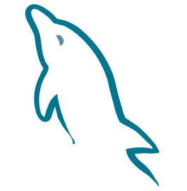

# Products Api

> Api REST criada no curso de <a href="https://cursos.alura.com.br/course/nestjs-api-rest-typescript">NestJS com TypeScript</a> da alura

## 🛠️ Construído com

🔹<a href="https://www.typescriptlang.org/">
  
    - TypeScript
</a>

🔹<a href="https://nestjs.com/">
    
     - NestJS
  </a>

🔹<a href="https://sequelize.org/">
  
    - Sequelize
</a>

🔹<a href="https://www.mysql.com/">
    
    - MySQL
</a>

## 🚧 Desenvolvimento

Para executar o projeto localmente é necessário:

🔹<a href="https://nodejs.org/en/">
    
     - Node.js
</a>

🔹<a href="https://www.npmjs.com/">
    
     - NPM
</a>

Após realizar o clone do projeto deve-se instalar das dependências:
```bash
npm install
```

E rodar:
```bash
npm start
```
para executar a aplicação.

> Também é necessário realizar a configuração das variáveis de ambiente através do arquivo **.env**

### ⚙️Scripts
> O projeto possui três scripts principais. Para executá-los é necessário realizar a instalação das dependências com `npm install`

Para executar a aplicação:
```bash
npm start
```

Para executar a aplicação em mode de desenvolvimento:
```bash
npm run start:dev
```

Para executar o `ESLint` e realizar a análise estática do código **JavaScript**:
```bash
npm run lint
```

## 👤Contatos
🔹<a href = "mailto:contato.miguelretroz@gmail.com" target="_blank">
  
  contato.miguelretroz@gmail.com
</a>

🔹<a href="https://www.linkedin.com/in/miguelretroz/" target="_blank">
  
   Miguel Retroz
</a>

🔹<a href = "https://www.instagram.com/miguel.retroz/" target="_blank">
  
  @miguel.retroz
</a>